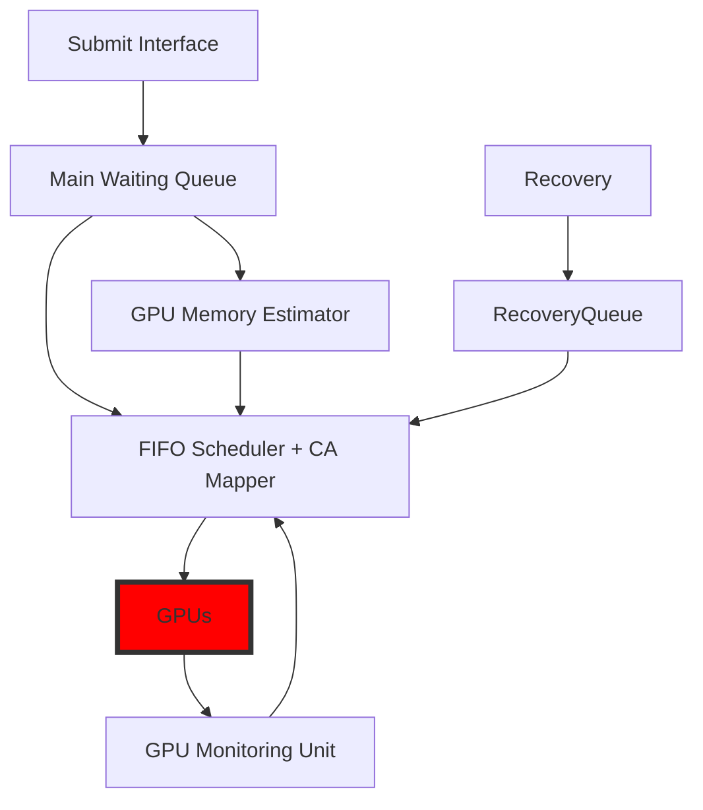

# CARMA: Collocation-Aware Resource Manager with GPU Memory Estimator

CARMA is a server-scale, task-level, collocation-aware resource manager that mitigates GPU underutilization in deep-learning training. By closely monitoring GPU resources and embedding collocation policies into placement, CARMA boosts performance, utilization, and energy efficiency. We argue that collocation-aware, task-informed resource management will be central to future DL infrastructure for higher resource efficiency.

<p align="center">

</p>


## CARMA architecture

Note that, **CA Mapper** stands for **C**ollocation-**A**ware **Mapper**



## Evaluation setup. 
We emulate realistic arrivals using a subset of the Philly cluster trace. From it, we constructed two derived traces of 60 tasks each. Because the original trace omits concrete job definitions, we instantiated representative light, medium, and heavy training tasks—covering CNNs, transformer-based models, and other workloads—aligned with recent observations of production cluster mixes.

### Transformer (WikiText-2) — *heavy*

| Model         | BS | GPUs | ET (m) | Epochs | Mem (GB) |
|:--------------|---:|----:|------:|------:|---------:|
| `xlnet_base`  |  8 |   2 |  7.38 |     8 |     9.20 |
| `BERT_base`   | 32 |   1 | 14.92 |     1 |    19.83 |
| `xlnet_large` |  4 |   2 | 19.58 |     3 |    19.33 |
| `BERT_large`  |  8 |   1 | 44.93 |     1 |    12.63 |
| `gpt2_large`  |  8 |   2 | 65.72 |     1 |    28.36 |


### Vision models, and a Recommender (ImageNet, VOC, COCO, Criteo) — *medium / heavy*

| Model              | BS | GPUs | ET (m) | Epochs | Mem (GB) |
|:-------------------|---:|----:|------:|------:|---------:|
| `efficientnet_b0`  |  32 |   1 | 41.96 |     1 |     3.75 |
| `efficientnet_b0`  |  64 |   1 | 28.48 |     1 |     6.70 |
| `efficientnet_b0`  | 128 |   1 | 27.52 |     1 |    12.67 |
| `resnet50`         |  32 |   1 | 34.96 |     1 |     3.94 |
| `resnet50`         |  64 |   1 | 32.58 |     1 |     7.11 |
| `resnet50`         | 128 |   1 | 31.27 |     1 |    13.24 |
| `mobilenet_v2`     |  32 |   1 | 29.47 |     1 |     3.36 |
| `mobilenet_v2`     |  64 |   1 | 25.70 |     1 |     6.04 |
| `mobilenet_v2`     | 128 |   1 | 25.44 |     1 |    11.34 |
| `vgg16`            |  32 |   1 | 50.77 |     1 |     6.69 |
| `vgg16`            |  64 |   1 | 46.70 |     1 |    11.77 |
| `vgg16`            | 128 |   1 | 44.60 |     1 |    21.87 |
| `Xception`         |  32 |   1 | 49.86 |     1 |     5.92 |
| `Xception`         |  64 |   1 | 48.82 |     1 |    11.20 |
| `Xception`         | 128 |   1 | 47.57 |     1 |    21.24 |
| `inception`        |  32 |   1 | 58.75 |     1 |     5.23 |
| `inception`        |  64 |   1 | 51.27 |     1 |     9.34 |
| `inception`        | 128 |   1 | 49.80 |     1 |    17.84 |
| `UNet`             |   8 |   1 |  0.35 |    90 |     9.91 |
| `MaskRCNN`         |   8 |   1 | 112.07 |     1 |    28.61 |
| `DLRM`             |   8 |   1 | 25.24 |   <1 |     1.47 |

### CNN (CIFAR-100) — *light*


| Model             | BS | GPUs | ET (m) | Epochs | Mem (GB) |
|:------------------|---:|----:|------:|:------:|---------:|
| `efficientnet_b0` |  32 |   1 | 1.06 | 20,50 |     0.67 |
| `efficientnet_b0` |  64 |   1 | 1.09 | 20,50 |     0.72 |
| `efficientnet_b0` | 128 |   1 | 1.14 | 20,50 |     8.67 |
| `resnet18`        |  32 |   1 | 0.49 | 20,50 |     0.79 |
| `resnet18`        |  64 |   1 | 0.23 | 20,50 |     0.80 |
| `resnet18`        | 128 |   1 | 0.17 | 20,50 |     0.86 |
| `resnet34`        |  32 |   1 | 0.83 | 20,50 |     1.01 |
| `resnet34`        |  64 |   1 | 0.44 | 20,50 |     1.02 |
| `resnet34`        | 128 |   1 | 0.22 | 20,50 |     2.08 |
| `S_mobilenetv3`   |  32 |   1 | 0.95 | 20,50 |     0.59 |
| `S_mobilenetv3`   |  64 |   1 | 0.50 | 20,50 |     0.60 |
| `S_mobilenetv3`   | 128 |   1 | 0.31 | 20,50 |     0.64 |


### Related tool: Philly Trace Analyzer & Task Mapper

For reproducibility, we provide a companion repository that analyzes the Philly trace and generates evaluation traces. It can:
- Extract a **configurable time window** from the Philly trace  
- Extract **waiting time** before each task submission and the **number of tasks** submitted 
- **Map** trace arrivals to specified jobs  
- **Simulate** a baseline on a **DGX Station A100** where each job gets GPUs **exclusively**. Note that the time of the tasks needs to be specified as it is a simulation.

👉👉👉 [Philly-Trace-Analyser-and-Task-Mapper](https://github.com/ehsanyousefzadehasl/Philly-Trace-Analyser-and-Task-Mapper)


## How to use

Start the task server:


```bash
python src/server.py
```

Submit a task described in a .rad file:

```bash
python src/submit.py --task /directory/of/your/task.rad
```


Example dispatch script used in our evaluation (staggered submissions with sleep):

```bash
sleep 29
python /home/username/rad-scheduler/src/submit.py --task /home/username/rad-scheduler/workloads/resnet34_cifar100_20e_3.rad
sleep 28
python /home/username/rad-scheduler/src/submit.py --task /home/username/rad-scheduler/workloads/resnet18_cifar100_20e_2.rad
sleep 151
python /home/username/rad-scheduler/src/submit.py --task /home/username/rad-scheduler/workloads/BERT_base.rad
sleep 124
```


## Further improvements TODOs

1. Implement robust recovery by indexing launched tasks (ditch temp dir).
2. Explore looser recovery options (instead of exclsive, consider another GPU with for example +5GB memory compared to the previous one).
3. Generalize the command generator for all task types (Non ML/DL).
4. Thinking about mechanisms for detecting the cases like asking for GPUs but not using them!

## License & Citation

© 2025 Ehsan Yousefzadeh-Asl-Miandoab. Affiliated with the [RAD](https://itu-dasyalab.github.io/RAD/), [IT University of Copenhagen](https://itu.dk/). All rights reserved.

This repository is released for **non-commercial academic research purposes only**. You may use, modify, and share the code for academic research, but **commercial use is prohibited**.

If you use this repository (code or ideas), you must cite the following:

### GitHub Repository
Ehsan Yousefzadeh-Asl-Miandoab. CARMA: Collocation-Aware Resource Manager with GPU Memory Estimator. GitHub Repository: https://github.com/ehsanyousefzadehasl/CARMA

```bibtex
@misc{yousefzadeh2025carma,
author = {Ehsan Yousefzadeh-Asl-Miandoab},
title = {CARMA: Collocation-Aware Resource Manager with GPU Memory Estimator},
year = {2025},
howpublished = {\url{https://github.com/ehsanyousefzadehasl/CARMA}}
}
```

### Academic Paper
```bibtex
@article{yousefzadeh2025carma,
  title={CARMA: Collocation-Aware Resource Manager with GPU Memory Estimator},
  author={Yousefzadeh-Asl-Miandoab, Ehsan and Karimzadeh, Reza and Ibragimov, Bulat and Ciorba, Florina M and Tozun, Pinar},
  journal={arXiv preprint arXiv:2508.19073},
  year={2025}
}
```